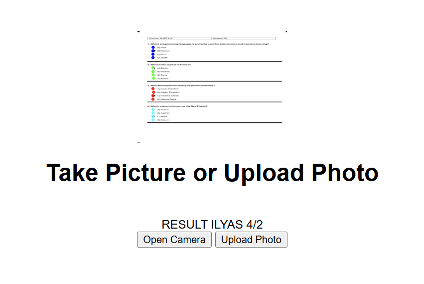

## Prerequisites

Make sure you have the following installed on your system:

- Python 3.8 or higher
- pip (Python package installer)
- A virtual environment (optional but recommended)

---

## Installation

### Clone the repository:
```bash
git clone https://github.com/your-repo-name/your-project.git
cd your-project
```

### Set up a virtual environment (optional):
```bash
python -m venv venv
source venv/bin/activate   # For Unix or macOS
venv\Scripts\activate      # For Windows
```

### Install dependencies:
```bash
pip install -r req.txt
```
---

## How to use

### RUN APP:
It will give a link http://127.0.0.1:5000/ Open in Browser.
```bash
python app.py
```

### Interface


Press upload and upload image from photos folder for example exp_1.png

### Output



---

###

